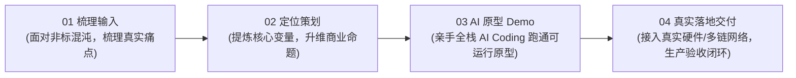

# 董达 ｜ 全链路解决方案与交付工程作品集
### 商业定义 · 工业中控状态机 · AI 自主系统

[](https://lx00018310.github.io/)
[](https://lx00018310.github.io/)
[](https://lx00018310.github.io/)
[](https://lx00018310.github.io/)
[](https://lx00018310.github.io/)
[](https://lx00018310.github.io/#emergentinc)

> 🚀 **在线作品集官网：[https://lx00018310.github.io/](https://lx00018310.github.io/)**  
> **核心能力：把模糊的想法梳理出来、定位好、策划好，亲手用 AI 做可运行 Demo，最后还能在真实环境落地交付。**

---

## 🎯 全链路交付能力模型 (End-to-End Capabilities)

我不做空洞的 PPT 演说，也不做玩具 Demo。我的能力贯穿从“原始模糊想法”到“真实业务交付”的完整四步：



---

## 🏆 三大代表性深度作品 (Featured Case Deep-Dive)

### 01. 商业定义 ｜ 考亭古街：把模糊的非标诉求，定义成能买单的商业方案
> **状态：212 万元设计服务合同闭环 ｜ 售前策划主创 ｜ 2019.07–2019.11** ｜ [查看在线深度解析 ➔](https://lx00018310.github.io/#tourism)

- **混沌输入（模糊的想法）**：地方政府举办文旅大会，文化资源庞大（理学、建盏、山水），客户原始诉求宏大却模糊：“要轰动、要有文化、要拉动消费”，各方诉求割裂，没人说得清项目到底该是什么。
- **破局提炼（把想法变清晰）**：跳出同质化“古镇小吃街”俗套，从文化源流与消费逻辑中提炼**“文旅溯源地”**核心命题：让每一处空间、业态与场景都成为文脉溯源的载体。
- **方案抗辩与商业闭环**：分解为空间落位、业态规划与运营蓝图，主持多轮高层汇报抗辩，击退竞品方案并推动立项；协同推进节点履约，所参与的设计服务合同额为 **212 万元**，达成阶段回款闭环。

---

### 02. 现场落地 ｜ 数字月台 & 机器人：把复杂的现场流程，交付为高可靠的工业中控
> **状态：真实生产环境已上线已验收 ｜ 100% No-Mock 交付** ｜ [查看在线深度解析 ➔](https://lx00018310.github.io/#industrial)

- **真实痛点**：自动装车涉及车辆排队入场、地磅过磅、现场多工位触屏、自动装车机、PLC 与人脸识别。客户初始诉求仅为单屏看板，根本无法处理多工位冲突与异常断线。
- **产品重塑**：重新抽象订单状态机、工位操作互斥规则与异常降级策略，将单屏需求升维为**多终端协同工业中控系统**，支持秒级配置热回退与数据归一化校验。
- **亲手实现与现场验收**：基于 Node.js / Fastify 构建中控核心服务，React / TypeScript 开发多工位触摸屏 HMI，WebSocket 广播实现毫秒级状态同步；深入天津项目一线排查修复机器人定位偏差，无缝联调现场真实 PLC，顺利通过甲方严苛现场验收。
- **技术栈**：`Node.js (Fastify)` / `React` / `TypeScript` / `WebSocket` / `PostgreSQL` / `Spring Boot` / `PLC 硬件通信`

---

### 03. AI 自主系统 ｜ EmergentInc 元胞会社：让 AI 走出对话框，构建自主进化的商业系统
> **状态：开源自主 Agent 商业系统架构 ｜ 全栈工程代码** ｜ [查看在线深度解析 ➔](https://lx00018310.github.io/#emergentinc)

- **业务愿景（突破对话框）**：打破传统大模型单次 Prompt 的“陪聊玩具”局限。构建一个**人提供想法与最终决策，AI 人物（千机）与元胞自主探索机会、构建产品、对外推广销售并持续进化**的开源系统。
- **四大闭环架构支柱**：
  1. **对外商城与 4 链 USDT 自动核销**：无需登录的公开商城前端，支持 Solana、BSC、Polygon、TRON 四大公链 USDT，通过独立 Reference 与唯一尾数匹配，实现零人工介入的自动收款核验。
  2. **pure-ast-json 纯 AST 解释沙箱**：智能体技能在受控遗传权限内生成，基于纯 AST JSON 解释执行 JavaScript 函数，**严禁 eval，严防未授权主机文件/网络/子进程外泄**。
  3. **持久 Workspace 状态机**：“代码可以变化，业务数据持续存在”。基于 SQLite 独立维护人物、订单、支付与谱系，代码热升级或回退时，商业事实永存。
  4. **Supervisor 审批自进化**：候选版本经 Vitest 测试与类型检查后，由 Supervisor 校验哈希并由 Owner 批准升级，确保 Agent 自进化可信受控。
- **技术栈**：`TypeScript` / `Node.js 24` / `pure-ast-json` / `SQLite` / `多链 RPC` / `Vitest` / `pnpm Workspace`

---

## 🛠️ 技术与能力全景 (Capabilities Matrix)

| 维度 | 掌握能力与技术栈 | 落地验证场景 |
| :--- | :--- | :--- |
| **01 商业梳理与定义** | 复杂非标需求抽象、差异化变量提炼、商业策划蓝图、高层方案汇报抗辩、商务履约与回款 | 考亭古街 212 万项目主创 |
| **02 工业中控与物理落地** | 工业状态机设计、多终端 HMI 协同、WebSocket 广播、PLC 协议联调、现场排障、No-Mock 交付 | 数字月台自动装车、天津机器人产线 |
| **03 AI 原生系统架构** | 自主 Agent 状态机、pure-ast-json 纯 AST 沙箱、区块链加密支付自动核销、持久工作区、自进化机制 | EmergentInc 元胞会社开源系统 |

---

## 💻 本地预览 (Local Development)

无需安装复杂运行时，任意静态服务器即可本地秒开预览：

```bash
# 方式 1: 使用 Python 快速启动
cd docs
python -m http.server 8080

# 方式 2: 使用 Node.js npx serve
npx serve docs
```

启动后在浏览器中打开 `http://localhost:8080` 即可浏览全部内容。

---

## 📬 联系交流与简历 (Get in Touch)

- **姓名**：董达 (Dong Da)
- **定位**：商业策划 · 工业中控 · AI 自主系统
- **城市**：杭州 / 湖州 / 苏州（吴江）· 支持短期出差
- **电话 / 微信**：`18761576008`
- **电子邮箱**：`624290365@qq.com`
- **在线简历**：[两页完整版简历](https://lx00018310.github.io/assets/resume.html) ｜ [一页精简版简历](https://lx00018310.github.io/assets/董达_简历_一页.html) ｜ [下载简历 PDF](https://lx00018310.github.io/assets/resume.pdf)
