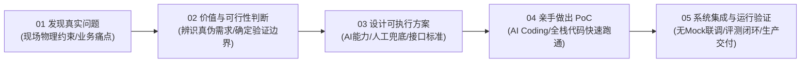

# 董达 ｜ AI 解决方案与落地工程作品集
### AI Solutions & Product Portfolio · 企业 AI 应用 · 快速 PoC · 工业智能

[](https://lx00018310.github.io/)
[](https://lx00018310.github.io/)
[](https://lx00018310.github.io/)
[](https://lx00018310.github.io/)
[](https://lx00018310.github.io/iro-agent.html)
[](https://lx00018310.github.io/iro-agent.html)

> 🚀 **在线作品集展厅：[https://lx00018310.github.io/](https://lx00018310.github.io/)**  
> 懂业务、能做方案、能亲手跑通可运行的原型与生产系统交付。不讲空洞叙事，用可运行证据支持业务决策。

---

## 📌 核心成果与指标看板 (Impact & Metrics)

| 核心指标 | 数据 / 成果 | 说明与证据 |
| :--- | :---: | :--- |
| **实装系统与创新原型** | **6+ 项** | 工业中控、Agent 智能体、机器人协同与移动端原型全覆盖 |
| **Agent 自动化测试闭环** | **210 项** | DEV / REGRESSION 双数据集 Grader 严密防劣化守护 |
| **售前商业策划合同额** | **212 万元** | 考亭古街主创“文旅溯源地”方案，跑通售前到回款全闭环 |
| **真实设备与协议集成** | **100% No-Mock** | 生产链路严禁 Mock，直连 PLC、机器人、WebSocket 与触摸屏 |

---

## 🎯 解决方案交付工作法 (Delivery Framework)

我的核心能力是把模糊、非标的企业痛点推进为一次**低成本、可运行、可验证**的解决方案闭环：



---

## 🏆 精选作品与解决方案展厅 (Featured Showcases)

### 01. IRO_agent：证据驱动的工业故障诊断 AI Agent
> **状态：应用验证 · 确定性评测闭环** ｜ [查看案例深度分析 ➔](https://lx00018310.github.io/iro-agent.html)

- **业务挑战**：工业现场故障排查充斥设备信号噪声、操作员主观误导与观测盲区，传统大模型对话极易产生幻觉且缺乏安全性。
- **解决方案**：
  - 将大模型从“一次性问答”升级为**逐轮竞争假设驱动的多步调查智能体**（Investigation Harness）；
  - 严格隔离只读沙箱工具，保障工业现场设备操作安全性；
  - 搭建 210 项自动化 Grader 评测流水线（DEV/REGRESSION 双数据集），建立防劣化持续回归基准。
- **技术栈**：`Python` / `Agent Harness` / `Tool Calling` / `Evidence Grounding` / `Evaluation` / `Read-Only Sandbox`

---

### 02. 数字月台：复杂业务产品化与多终端协同中控
> **状态：生产环境已上线已验收** ｜ [查看系统拓扑与业务流转 ➔](https://lx00018310.github.io/digital-dock.html)

- **业务挑战**：工厂自动装车场景涉及车辆排队、过磅、自动装车机、人脸识别等多环节，原始需求仅为单屏显示，缺乏整体流程协同。
- **解决方案**：
  - 重新梳理订单、工位与异常状态机，扩展为高可靠多终端工业中控系统；
  - 基于 Node.js / Fastify 与 PostgreSQL 统一维护订单流转，通过 WebSocket 向多终端实时广播；
  - 对接 PLC 与人脸识别桥接服务，支持秒级版本回滚与生产数据归一化校验。
- **技术栈**：`TypeScript` / `React` / `Node.js (Fastify)` / `WebSocket` / `PostgreSQL` / `PLC 硬件联调`

---

### 03. 天津机器人产线：跨系统协同与现场排障
> **状态：已交付现场** ｜ [查看产线协同流程 ➔](https://lx00018310.github.io/robot-line.html)

- **业务挑战**：就餐高峰期需打通刷卡终端、机械抓取机构与送餐机器人，设备异构且通信节拍严苛。
- **解决方案**：全程参与工控主程序核心状态流转与通信协议封装；深入项目一线排查并消除送餐机器人现场定位偏差，恢复产线自动化节拍。
- **技术栈**：`Java` / `Spring Boot` / `机器人通信协议` / `跨系统协同` / `现场排障`

---

### 04. 考亭古街：0→1 商业策划与顶层设计
> **状态：212 万元设计服务合同闭环** ｜ [查看商业定义详情 ➔](https://lx00018310.github.io/#commercial)

- **业务挑战**：文旅大会重大非标诉求，历史人文资源丰富但缺乏统一市场主题与可落地的顶层定位。
- **解决方案**：从市场、文化、受众与客户目标中提炼“文旅溯源地”核心命题，作为售前主创完成多轮高层汇报，推动 212 万元合同签署与全流程实施回款闭环。
- **核心能力**：`0→1 业务定义` / `售前策划主创` / `复杂非标需求抽象` / `商业闭环`

---

### 05. ToyWake：克制交互与场景化 AI 激发原型
> **状态：个人原型实验** ｜ [查看交互分镜与降级机制 ➔](https://lx00018310.github.io/toywake.html)

- **设计哲学**：解决“AI 过度介入剥夺真实亲子互动”的痛点，确立“AI 只负责点火，随后退出”的克制产品边界。
- **工程实现**：设计三步交互分镜与双层降级容错机制，完成 FastAPI 后端与 Android 客户端双端原型快速验证。
- **技术栈**：`Python` / `FastAPI` / `Android` / `AI 交互边界设计` / `容错降级`

---

### 06. SimpleHmi：工业中控工程规范与 No-Mock 交付标准
> **状态：开源工程规范** ｜ [查看规范详情 ➔](https://lx00018310.github.io/simplehmi-weili.html)

- **核心原则**：确立“生产链路禁止 Mock、功能完成必须有证据”的工业交付规范。
- **沉淀资产**：提供从需求卡片到工控触屏界面的轻量化工程模板，探索 AI 时代高质量工程落地标准。
- **技术栈**：`Vue` / `HMI 触屏规范` / `No-Mock 原则` / `工程标准化`

---

### 07. 湖州美食地图：多源数据清洗与移动交互原型
> **状态：移动原型** ｜ [查看数据流与原型 ➔](https://lx00018310.github.io/huzhou-food-map.html)

- **产品亮点**：多源本地店铺信息清洗与经纬度纠偏，针对单手移动操作优化的人体工学地图交互实验。
- **技术栈**：`高德地图 API` / `数据清洗` / `单手操作人机工学`

---

## 🛠️ 技术能力矩阵 (Tech Stack Matrix)

| 维度 | 掌握能力与技术栈 | 落地验证场景 |
| :--- | :--- | :--- |
| **AI Agent & 算法应用** | Python, Agent Harness, Tool Calling, Evidence Grounding, Evaluation Grader, Read-Only Sandbox | IRO_agent 故障排查、ToyWake 交互生成 |
| **企业应用与快速原型** | TypeScript, React, Vue, Node.js (Fastify), FastAPI, Spring Boot, Android | 数字月台中控、美食地图、触屏 HMI |
| **工业集成与工程可靠性** | WebSocket 状态广播, PostgreSQL, PLC 硬件通信, 状态机设计, 生产环境版本秒级回退 | 自动装车月台、天津送餐机器人产线 |
| **商业定义与售前策划** | 非标诉求抽象, 0→1 商业逻辑, 方案售前汇报, 商务履约与回款闭环 | 考亭古街 212 万项目主创 |

---

## 📂 项目结构 (Repository Structure)

```text
├── docs/                      # 线上作品集静态站点 (GitHub Pages 根目录)
│   ├── index.html             # 作品集官网主页 (Showcase Gallery & 看板)
│   ├── iro-agent.html         # IRO_agent 工业诊断智能体案例深度解析
│   ├── digital-dock.html      # 数字月台工业中控系统案例深度解析
│   ├── robot-line.html        # 天津机器人产线协同案例解析
│   ├── toywake.html           # ToyWake 亲子 AI 原型案例解析
│   ├── simplehmi-weili.html   # SimpleHmi 工业交付工程规范
│   ├── huzhou-food-map.html   # 湖州美食地图数据原型案例解析
│   ├── ai-engineering.html    # AI 辅助开发方法与三级证据闭环
│   └── assets/                # 样式、交互脚本、图片与简历文件
│       ├── site.css           # Swiss / Technical 印刷风设计系统
│       ├── resume.pdf         # 完整版主投简历 (PDF 2页)
│       └── visuals/           # 系统拓扑图、业务流转图与 SVG 架构资产
└── README.md                  # 本说明文档
```

---

## 💻 本地预览 (Local Development)

无需安装复杂运行时，任意静态服务器即可本地秒开预览：

```bash
# 方式 1: 使用 Python 快速启动
cd docs
python -m http.server 8080

# 方式 2: 使用 Node.js npx serve
npx serve docs
```

启动后在浏览器中打开 `http://localhost:8080` 即可浏览全部页面。

---

## 📬 联系交流与简历 (Get in Touch)

- **姓名**：董达 (Dong Da)
- **定位**：AI 解决方案顾问 / AI 落地工程 / 工业智能产品经理
- **城市**：杭州 / 湖州 / 苏州（吴江）· 支持短期出差
- **电话 / 微信**：`18761576008`
- **电子邮箱**：`624290365@qq.com`
- **在线简历**：[两页完整版简历](https://lx00018310.github.io/assets/resume.html) ｜ [一页精简版简历](https://lx00018310.github.io/assets/董达_简历_一页.html) ｜ [下载简历 PDF](https://lx00018310.github.io/assets/resume.pdf)
